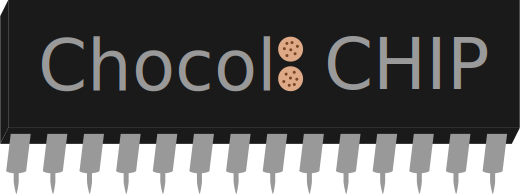

# Chocol8 CHIP

  

  
  
  
  

# Introduction

Chocol8 CHIP is a portable CHIP-8 interpreter. It provides interfaces for graphics, sound and keyboard. This way, it can easily be ported to other Java-based platforms/frontends.
